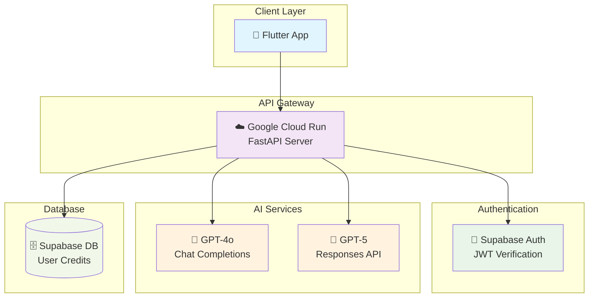
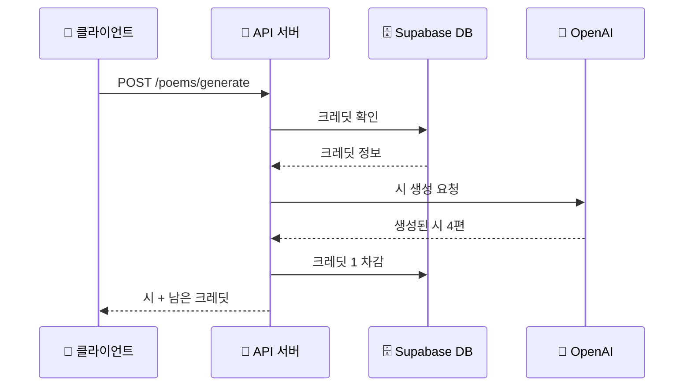
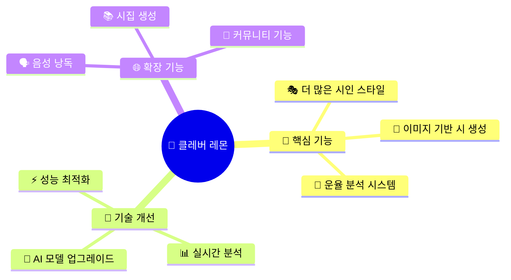
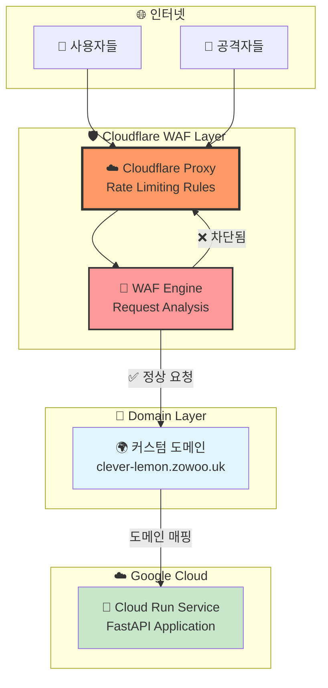
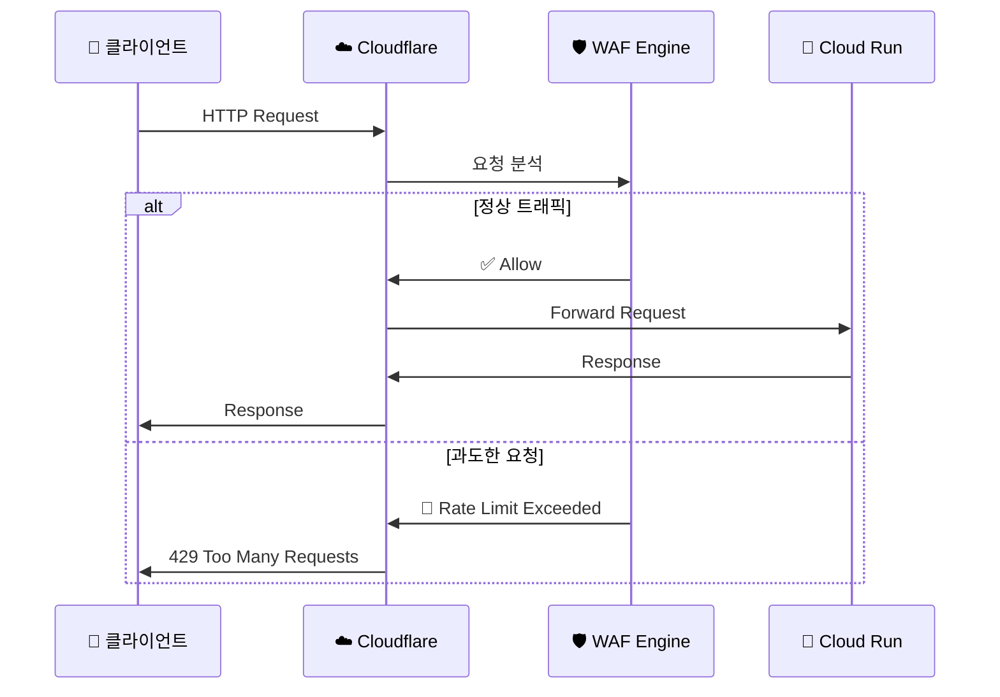

# 🌸 클레버 레몬 - AI 시 창작 API 서버 🍋

> 한국어 시 창작의 새로운 패러다임! AI와 함께 감성적인 시를 만들어보세요.

[](https://fastapi.tiangolo.com/)
[](https://python.org)
[](https://cloud.google.com/)
[](https://supabase.com/)
[](https://openai.com/)

## 🚀 프로젝트 소개

본 프로젝트는 AI의 힘을 빌려 아름다운 한국어 시를 창작하는 서비스입니다. Flutter 모바일 앱의 백엔드로 설계되었으며, 사용자는 자신만의 감성과 키워드를 바탕으로 개성 있는 시를 생성할 수 있습니다.

### ✨ 주요 기능

- 🎭 **다양한 시 스타일**: 윤동주, 김소월 등 유명 시인의 스타일로 시 창작
- 🎨 **감정 기반 창작**: 낭만적, 우울한, 희망적 등 다양한 감정 표현
- 🔑 **키워드 활용**: 사용자가 입력한 키워드를 자연스럽게 녹인 시 생성
- 💎 **크레딧 시스템**: 공정한 사용을 위한 크레딧 기반 서비스
- 🔐 **보안 인증**: Supabase JWT 토큰을 통한 안전한 사용자 인증

## 🏗️ 시스템 아키텍처



## 🎯 API 엔드포인트

### 🏥 헬스체크
```http
GET /ping
```
서버 상태를 확인합니다.

### 🔑 인증 관련
```http
POST /auth/register        # 사용자 등록 (액세스 토큰)
```

### 🌸 시 생성 (핵심 기능!)
```http
POST /poems/generate
```

**요청 예시:**
```json
{
  "user_id": "xxxxxxxx-xxxx-xxxx-xxxx-xxxxxxxxxxxx",
  "style": "낭만적인",
  "author_style": "윤동주",
  "keywords": ["달", "그리움", "희망"],
  "length": "8행"
}
```

**응답 예시:**
```json
{
  "success": true,
  "request": {
    "style": "낭만적인",
    "author_style": "윤동주",
    "keywords": ["달", "그리움", "희망"],
    "length": "8행"
  },
  "poems": [
    "밤하늘의 달빛\n\n그리운 마음 속에\n달빛이 스며들어\n희망의 씨앗을 심네\n...",
    "두 번째 시...",
    "세 번째 시...",
    "네 번째 시..."
  ],
  "generation_time": 25.3,
  "remaining_credits": 99
}
```

## 🔧 개발 환경 설정

### 📋 필수 요구사항
- 🐍 Python 3.12+
- 📦 uv 패키지 매니저
- 🔑 OpenAI API Key
- 🔐 Supabase 프로젝트 설정

### 🛠️ 로컬 개발 시작하기

1. **저장소 클론**
   ```bash
   git clone https://github.com/izowooi/clever-lemon.git
   cd clever-lemon
   ```

2. **종속성 설치**
   ```bash
   uv sync
   ```

3. **환경변수 설정**
   ```bash
   cp .env.example .env
   # .env 파일을 열어 실제 값들로 수정하세요
   ```

4. **개발 서버 실행**
   ```bash
   uvicorn main:app --host 0.0.0.0 --port 8000 --reload
   ```

5. **API 문서 확인**
   ```
   📖 Swagger UI: http://localhost:8000/docs
   📋 ReDoc: http://localhost:8000/redoc
   ```

## 🧪 테스트 방법

### 📡 HTTP 파일을 이용한 테스트
프로젝트에 포함된 `test_main.http` 파일을 사용하여 모든 엔드포인트를 테스트할 수 있습니다.

```bash
# VS Code REST Client 확장을 설치한 후
# test_main.http 파일을 열어 각 요청을 실행
```

### 🎭 시 생성 테스트 시나리오



## 🌐 배포 가이드

### 🚀 자동 배포 (추천)
```bash
# deploy.sh 스크립트 실행
./deploy.sh
```

### ⚙️ 수동 배포
```bash
# Google Cloud CLI 설정 후
gcloud run deploy clever-lemon \
    --source . \
    --region=asia-northeast1 \
    --platform=managed \
    --allow-unauthenticated
```

### 🔧 환경변수 설정
배포 시 다음 환경변수들이 필요합니다:

```bash
SUPABASE_URL=https://your-project.supabase.co
SUPABASE_SERVICE_ROLE_KEY=your-service-role-key
OPENAI_API_KEY=sk-your-openai-api-key
OPENAI_MODEL=gpt-5-mini-2025-08-07  # 또는 gpt-4o-mini
```

## 🏛️ 프로젝트 구조

```
📦 clever-lemon/cloud_run_proj
├── 🐍 main.py                     # FastAPI 메인 애플리케이션
├── 🔐 verify_token.py             # JWT 토큰 검증 모듈
├── 🎨 poem_generator_modern.py    # AI 시 생성 엔진
├── 📋 pyproject.toml              # 프로젝트 의존성
├── 🐳 Dockerfile                  # 컨테이너 설정
├── 🚀 deploy.sh                   # 자동 배포 스크립트
├── 🧪 test_main.http              # API 테스트 파일
├── 📝 .env.example                # 환경변수 템플릿
└── 📚 docs/                       # 문서 디렉토리
```

## 🔍 기술 스택 상세

### 🎨 AI 시 생성 시스템
- **GPT-4o 모델**: 전통적인 Chat Completions API 활용
- **GPT-5 모델**: 최신 Responses API와 reasoning 기능 활용
- **이중 파싱 시스템**: JSON 파싱 실패 시 fallback 메커니즘

### 💳 크레딧 시스템
- **사전 검증**: 시 생성 전 크레딧 확인
- **트랜잭션 안전성**: 성공 시에만 크레딧 차감
- **실시간 업데이트**: 남은 크레딧 정보 실시간 제공

### 🔐 보안 시스템
- **JWT 검증**: Supabase 표준 JWT 토큰 검증
- **알고리즘 지원**: ES256, RS256, EdDSA
- **키 회전 대응**: JWKS 엔드포인트 활용

## 🌟 미래 계획



## 🛡️ DDoS 보안 설정

이 프로젝트는 Cloudflare WAF(Web Application Firewall)의 Rate Limiting Rules를 활용하여 DDoS 공격으로부터 보호됩니다.

### 🏗️ 보안 아키텍처



### ⚙️ 설정 단계

#### 1️⃣ Google Cloud Run 커스텀 도메인 매핑

Google Cloud Run에서 커스텀 도메인을 연결합니다:

```bash
# 도메인 매핑 생성
gcloud run domain-mappings create \
    --service=clever-lemon-api \
    --domain=clever-lemon.zowoo.uk \
    --region=asia-northeast1
```

**주요 설정:**
- 📍 **Cloud Run URL (A)**: `https://clever-lemon-api-xxx.run.app`
- 🌍 **커스텀 도메인 (B)**: `https://clever-lemon.zowoo.uk`
- 🔄 **매핑 결과**: 도메인 B로의 요청이 도메인 A로 자동 전달

#### 2️⃣ Cloudflare Rate Limiting Rules 설정

Cloudflare 대시보드에서 WAF Rate Limiting 규칙을 생성합니다:



**Rate Limiting Rule 설정:**

1. **🎯 매칭 조건 (Match Expression):**
   ```
   (http.host eq "clever-lemon.zowoo.uk")
   ```
   - 특정 호스트명에 대한 모든 요청에 규칙 적용

2. **⚡ Rate Limiting 파라미터:**
   ```yaml
   규칙 이름: "API Protection Rule"
   요청 임계값: 100 requests
   시간 창: 1 minute  
   액션: Block
   차단 기간: 10 minutes
   ```

3. **🚫 차단 응답:**
   ```json
   {
     "error": "Rate limit exceeded",
     "code": 1015,
     "message": "Too many requests from this IP"
   }
   ```

#### 3️⃣ 상세 WAF 설정 가이드

**📊 Cloudflare 대시보드 설정:**

1. **Security > WAF** 섹션으로 이동
2. **Rate limiting rules** 탭 선택
3. **Create rule** 버튼 클릭
4. **Rule configuration:**
   ```
   ✅ Rule name: "Poetry API DDoS Protection"
   ✅ When incoming requests match: (http.host eq "clever-lemon.zowoo.uk")
   ✅ Then: Block
   ✅ For: 10 minutes
   ✅ Counting: All requests
   ✅ Period: 1 minute
   ✅ Threshold: 100 requests per minute
   ```

**🔧 고급 설정 옵션:**
- **IP 기반 제한**: 동일 IP에서 과도한 요청 차단
- **지역별 제한**: 특정 국가/지역에서의 요청 제한
- **Bot 탐지**: 자동화된 봇 트래픽 식별 및 차단

### 🎯 보안 효과

**✅ 달성한 보안 목표:**
- 🚫 **DDoS 공격 차단**: Cloud Run 도달 전 Cloudflare에서 차단
- ⚡ **응답 속도 개선**: 악성 트래픽 사전 필터링으로 서버 부하 감소
- 💰 **비용 절약**: Cloud Run 불필요한 컴퓨팅 리소스 사용 방지
- 📊 **실시간 모니터링**: Cloudflare Analytics를 통한 트래픽 패턴 분석

**🔍 모니터링 지표:**
- **Request Rate**: 분당 요청 수
- **Block Rate**: 차단된 요청 비율
- **Geographic Distribution**: 지역별 트래픽 분포
- **Threat Score**: 위험도 점수 분석

### 🚨 긴급 대응 절차

악성 트래픽 감지 시 추가 대응 방안:

1. **🔥 즉시 대응**: Cloudflare에서 해당 IP/국가 차단
2. **📊 분석**: 공격 패턴 및 트래픽 소스 분석
3. **⚙️ 규칙 조정**: Rate Limiting 임계값 동적 조정
4. **🔄 복구**: 정상화 후 점진적 규칙 완화

## ⏰ 자동 크레딧 보충 시스템 (Supabase pg_cron)

사용자의 무료 크레딧이 10 이하인 경우 자동으로 10으로 보충하는 시스템을 설정할 수 있습니다.

### 🛠️ 설정 단계

#### 1️⃣ Supabase Dashboard 접속
1. **Supabase Dashboard** 로그인
2. 프로젝트 선택
3. 좌측 메뉴에서 **Database** 클릭

#### 2️⃣ pg_cron Extension 활성화
1. **Extensions** 탭 선택
2. **pg_cron** 검색 후 **Enable** 버튼 클릭
3. Extension 활성화 완료 확인

#### 3️⃣ 자동 크레딧 보충 Job 생성
**SQL Editor**에서 다음 쿼리를 실행하여 매일 자동으로 크레딧을 보충합니다:

```sql
-- 매일 오전 9시에 free_credits가 10 이하인 사용자에게 크레딧 보충
SELECT cron.schedule(
    'daily-free-credits-replenishment',  -- job 이름
    '0 9 * * *',                        -- cron 표현식 (매일 오전 9시)
    $$
    UPDATE users_credits
    SET
        free_credits = 10,
        updated_at = now()
    WHERE
        free_credits <= 10
        AND deleted_at IS NULL;
    $$
);
```

### 📊 Cron 스케줄 설명

| 표현식 | 의미 | 실행 시간 |
|--------|------|-----------|
| `0 9 * * *` | 매일 오전 9시 | 09:00 |
| `0 0 * * *` | 매일 자정 | 00:00 |
| `0 */6 * * *` | 6시간마다 | 00:00, 06:00, 12:00, 18:00 |
| `0 0 * * 1` | 매주 월요일 자정 | 월요일 00:00 |

## 📄 라이센스

이 프로젝트는 MIT 라이센스 하에 배포됩니다. 자세한 내용은 `LICENSE` 파일을 확인하세요.

## 📞 문의하기

- 💼 프로젝트 이슈: [GitHub Issues](https://github.com/izowooi/clever-lemon/issues)

---

<div align="center">

**🌸 아름다운 시의 세계로 여러분을 초대합니다 🌸**

Made with 💖 by izowooi

</div>